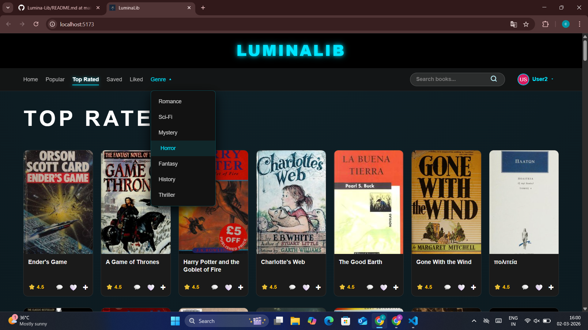
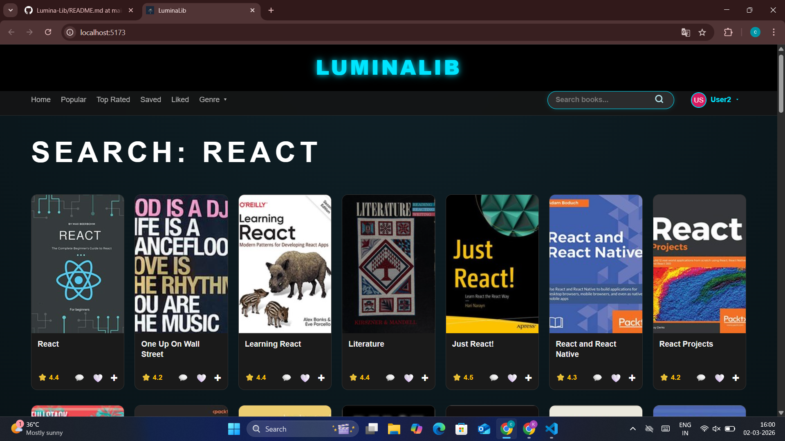

# 📚 LuminaLib - Modern Library Management System

LuminaLib is a full-stack MERN (MongoDB, Express, React, Node.js) application designed for book enthusiasts to discover, review, and manage their favorite reads. It features a sleek, dark-themed UI built with React and Vite, supported by a robust Node.js/Express backend.

---

## 🖼️ Project Showcases

### 🏠 Home Dashboard
A dynamic hero section featuring trending titles and a categorized layout for easy navigation.


---

### 📂 Genre & Discovery
Advanced filtering by genre (Romance, Sci-Fi, Horror, etc.) allowing users to explore specific niches within the library.



---

### 🔍 Powerful Search
Instant search functionality to find specific books or topics across the entire collection.



---

## 🚀 Key Features

- 🔐 **User Authentication:** Secure login and personalized user profiles  
- ❤️ **Book Interactions:** Like, save, and review your favorite books  
- 📱 **Responsive Design:** Optimized for seamless experience across all device sizes  
- ⚡ **Real-time Data:** Powered by MongoDB to ensure your library is always up to date  

---

## 🛠️ Tech Stack

### Frontend
- React.js  
- Vite  
- CSS3 (Custom Styling)

### Backend
- Node.js  
- Express.js  

### Database
- MongoDB  
- Mongoose  

### Deployment & Version Control
- Git  
- GitHub  

---

## 📁 Project Structure

```
Lumina-Lib/
├── client/                # Frontend (React + Vite)
│   ├── public/            # Static assets
│   ├── src/
│   │   ├── components/    # Reusable UI components
│   │   ├── pages/         # Page views (Home, Genre, Search)
│   │   ├── App.jsx        # Main App component
│   │   └── main.jsx       # Entry point
│   ├── package.json
│   └── vite.config.js
├── server/                # Backend (Node.js + Express)
│   ├── config/            # Database connection (MongoDB)
│   ├── controllers/       # Logic for routes
│   ├── models/            # Mongoose schemas (Book, User)
│   ├── routes/            # API endpoints
│   ├── .env               # Environment variables (Private)
│   ├── index.js           # Server entry point
│   └── package.json
├── OutComes/              # Project Screenshots for README
│   ├── home.png
│   ├── top-rated-genre.png
│   └── search.png
├── .gitignore             # Files to ignore (node_modules, .env)
└── README.md              # Project documentation
```

---

## ⚙️ Installation & Setup

### 1️⃣ Clone the Repository

```bash
git clone https://github.com/KC-Krishna07/Lumina-Lib.git
cd Lumina-Lib
```

---

## 2️⃣ Backend Configuration

Navigate to the server folder:

```bash
cd server
```

Install dependencies:

```bash
npm install
```

Create a `.env` file inside the `/server` folder and add:

```env
MONGO_URI=your_mongodb_connection_string
PORT=5000
```

Start the backend server:

```bash
npm start
```

---

## 3️⃣ Frontend Configuration

Open a new terminal in the root `Lumina-Lib` folder.

Install dependencies:

```bash
npm install
```

Start the Vite development server:

```bash
npm run dev
```

---

## 👨‍💻 Developed By

**KC-Krishna07**

---

⭐ If you like this project, consider giving it a star on GitHub!